<div align="center">



<br/>

[](https://portfolio-nine-blush-kxs5umenr8.vercel.app)
[](mailto:hassan.shahzad.info@gmail.com)
[](https://www.linkedin.com/in/muhammad-hassan-shahzad-hu27)

</div>

```console
hassan@habib:~$ whoami
CS undergrad @ Habib University, Karachi — NLP researcher, automation developer.
Two peer-reviewed papers before graduating. Ships tools, not demos.

hassan@habib:~$ cat /etc/motd
My portfolio is a chatbot trained on my résumé. It answers questions about me
so this README doesn't have to. This README exists anyway. I like redundancy —
every system I build has a fallback, including this introduction.

hassan@habib:~$ uptime
currently: Developer @ Office Automation Services · shipping LLM pipelines
```

<br/>

## `$ ls ~/github --tree`

```
hassan09070/
├── 🔬 research/
│   ├── semeval2026 ······· DimABSA — VA regression, 6 languages · 🥈 2nd (Tatar), 6th (Russian)
│   └── clef-labs-2026 ···· FinMMEval — structure-aware RAG + MoE · 🌍 10th on the global leaderboard
├── 🛠 products/
│   ├── portfolio ········· a portfolio you argue with instead of scroll (beta)
│   ├── khaata360 ········· WhatsApp bookkeeper — "spent 500 on food" → ledger entry
│   └── takhleeq ·········· 6-DOF robot arm math, twice (Python + TS), agreeing to 4 decimals
├── 🧗 grind/
│   └── neetcode250 ······· ████████░░░░░░░░░░░░░░░░░░░░ 69/250 — all 250 before 2027
└── 🌱 upstream/
    └── sugarlabs ········· 5 merged PRs into software running in classrooms worldwide
```

<br/>

## `$ cat research/publications.bib`

> ### 📄 [Habib University at SemEval-2026 Task 3: A Pipeline Approach for Dimensional Aspect-Based Sentiment Analysis](https://aclanthology.org/2026.semeval-1.428/)
> *Proc. of the 20th International Workshop on Semantic Evaluation (SemEval-2026), pp. 3449–3459 — ACL*
>
> Sentiment as a **continuous valence–arousal space**, not three labels. A four-stage
> multilingual pipeline (mDeBERTa extraction → pairing → category → regression) across
> **6 languages, 4 domains** — including a Double-[NULL]-token trick for implicit aspects.
> **🥈 2nd place — Tatar · 6th — Russian** &nbsp;→&nbsp; [`code`](https://github.com/hassan09070/semeval2026)

> ### 📄 HU_LLM_Fin @ FinMMEval 2026 Task 2: A Structure-Aware Hybrid RAG Pipeline utilizing Mixture-of-Experts
> *CLEF 2026 Working Notes — Jena, Germany*
>
> Standard RAG chunking **shreds financial tables** — a row without its header is a number
> without a year. Row-aware chunking + partitioned two-stage retrieval + prompt-caged
> Llama-4-Scout MoE, over SEC filings and news in five languages.
> **🌍 10th globally** (GPT-4o scores 9.79% on this benchmark) &nbsp;→&nbsp; [`code`](https://github.com/hassan09070/clef-labs-2026)

<br/>

## `$ git log --author=hassan --remotes=upstream`

**Merged into [Sugar Labs](https://github.com/sugarlabs)** — LLM context management for the AI reflection feature in Music Blocks, educational software used in classrooms worldwide:

| | PR | shipped |
|---|---|---|
| `merged ✓` | [musicblocks#5991](https://github.com/sugarlabs/musicblocks/pull/5991) | Sliding-window conversation memory with summarization |
| `merged ✓` | [musicblocks#6120](https://github.com/sugarlabs/musicblocks/pull/6120) | Reflection widget UX — centering + refresh feedback |
| `merged ✓` | [reflection_fastapi#5](https://github.com/sugarlabs/musicblocks_reflection_fastapi/pull/5) | Sliding window, server side |
| `merged ✓` | [reflection_fastapi#3](https://github.com/sugarlabs/musicblocks_reflection_fastapi/pull/3) | Cut Gemini API cost via `thinking_budget` |
| `merged ✓` | [reflection_fastapi#4](https://github.com/sugarlabs/musicblocks_reflection_fastapi/pull/4) | Docs for the above |
| `closed ✗` | [zulip#37279](https://github.com/zulip/zulip/pull/37279) | Emoji indicators for GitHub webhook notifications |
| `closed ✗` | [gemini-cli#19633](https://github.com/google-gemini/gemini-cli/pull/19633) | Track deleted & corrupted sessions |

<sub>The ✗ rows stay listed on purpose. Shots taken > shots hidden.</sub>

<br/>

## `$ ./showcase --interactive`

<table>
<tr>
<td width="50%" valign="top">

### 🗣 [Ask Hassan](https://github.com/hassan09070/portfolio)
**The portfolio that answers back.** An AI twin grounded strictly in my résumé —
if the LLM dies, a local keyword engine takes over, tagged *offline mode*.
The site cannot break. I checked. Repeatedly.

`Next.js` `TypeScript` `OpenRouter` `SSE`

**[→ interrogate it live](https://portfolio-nine-blush-kxs5umenr8.vercel.app)**

</td>
<td width="50%" valign="top">

### 💸 [Khaata360](https://github.com/hassan09070/khaata360-open-source)
**Bookkeeping by text message.** WhatsApp in, ledger out — natural language and
receipt photos parsed by vision LLMs. Built to a full SE process: SRS, SDS, Jira
sprints. University course, industrial discipline.

`FastAPI` `Next.js` `MongoDB` `Twilio`

</td>
</tr>
<tr>
<td width="50%" valign="top">

### 🦾 [Takhleeq](https://github.com/hassan09070/takhleeq)
**Motor math for a real robot arm** — the Dawlance × Habib *Summer Tehqiq*
research program, building a 6-DOF arm from scratch in a country where nobody
manufactures one. Same physics implemented twice (Python GUI + web); a parity
test keeps both honest to 4 decimal places.

`Python` `Tkinter` `Next.js` `52-motor catalogue`

</td>
<td width="50%" valign="top">

### 🧗 [NeetCode 250](https://github.com/hassan09070/neetcode250)
**Public accountability as a feature.** Every solution committed with its
runtime percentile; a script regenerates the progress bar so the README can't
flatter me. 69 down. 181 to go. Deadline: 2026-12-31.

`Python` `C++` `SQL` `self-updating README`

</td>
</tr>
</table>

<br/>

## `$ htop --user hassan`

<div align="center">


<br/><br/>

<picture>
  <source media="(prefers-color-scheme: dark)" srcset="https://raw.githubusercontent.com/hassan09070/hassan09070/output/snake-dark.svg" />
  
</picture>

<sub>panels and snake are hand-rolled SVG, regenerated nightly at 03:00 UTC by a workflow in this repo — no third-party stat service left to 503</sub>

</div>

<br/>

```console
hassan@habib:~$ ./contact --any-channel
  email     hassan.shahzad.info@gmail.com
  linkedin  linkedin.com/in/muhammad-hassan-shahzad-hu27
  fastest   ask my portfolio bot — it knows my schedule better than I do

hassan@habib:~$ exit
logout
Connection to hassan closed. (but the automations are still running)
```

<div align="center">

</div>
